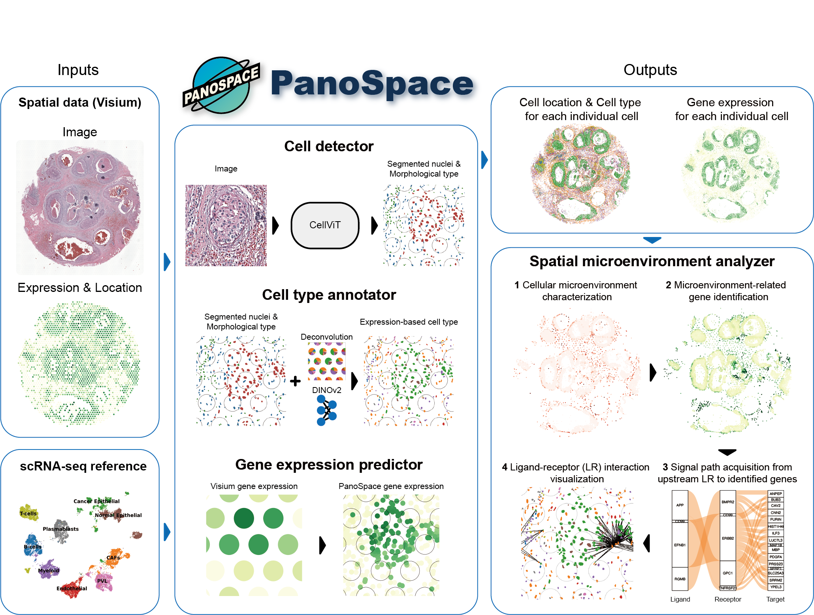

# Unlocking single-cell level and whole-tissue insights in spatial transcriptomics with PanoSpace



**PanoSpace** is a Python package designed for single-cell level analysis and visualization of low-resolution spatial transcriptomics data, such as Visium. By integrating scRNA-seq data, low-resolution spatial transcriptomics data, and high-definition H&E-stained images from the same tissue region or type, PanoSpace transforms spot-level spatial transcriptomics data into detailed, whole-tissue single-cell insights. This enables accurate cell detection, cell type annotation, and gene expression prediction at a single-cell resolution. Additionally, PanoSpace facilitates in-depth analysis of intra-cell type heterogeneity and cell-cell interactions, unlocking new dimensions of spatial biology.

This repository is currently under construction.

## Installation

To install PanoSpace:

- Set up conda environment for PanoSpace:
    ```bash
    conda env create -f environment.yml
    conda activate PanoSpace
    pip install torch==2.4.0 torchvision==0.19.0 pytorch-lightning==2.1.2
    ```
Above, we install PyTorch version 2.4 with CUDA 12.2.

- Clone the repository and install the PanoSpace using `pip`:
    ```bash
    git clone https://github.com/hehuifeng/PanoSpace.git
    cd PanoSpace
    pip install .
    ```

- Check the installation status in Python:
    ```python
    import panospace as ps
    ps.__version__
    # '0.1.0'
    ```

## Reproducibility
We provide source codes for reproducing the PanoSpace analysis in the main text in the `demos` directory.

- [10x Visium Breast Cancer dataset](demo/Visium_Breast_Reproducibility.ipynb)
 
## Contact information
Please contact Hui-Feng He (<huifeng@mails.ccnu.edu.cn>) or Prof. Xiao-Fei Zhang (<zhangxf@ccnu.edu.cn>) if any enquiry.